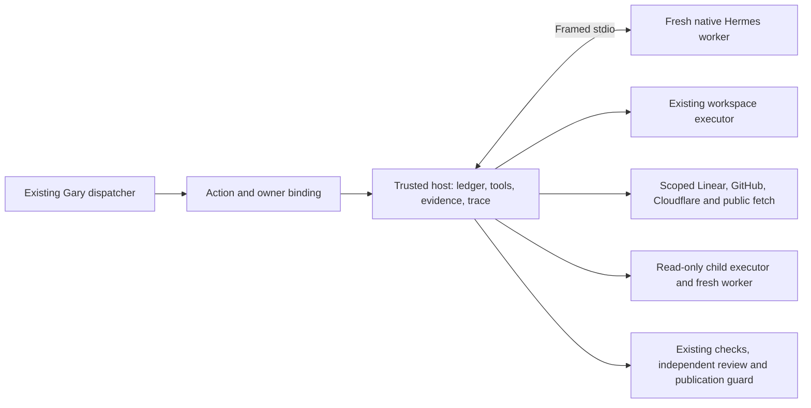

# Gary → Hermes production integration

Hermes is selected explicitly through `src/startup.ts` and the reviewed host configuration. The initial implementation was prepared from Gary commit `2f56d9f98bd3b0f5bb5d68b916dfcba6df382868`; subsequent deployment receipts record activation and later source transitions. Do not use this historical implementation handoff to infer current live source, task success or enabled capabilities.

This document describes the core integration. See [project-assistant.md](project-assistant.md) for the later project conversation tools and memory. Each live transition remains bound to its exact reviewed source/configuration and canonical state.

## Implementation

`LoopDeps.createAdmittedCodeLoop` binds the optional runtime to the existing dispatcher. It receives the actual action ID, ticket, fingerprint, repository, provider/model and existing spending ledger. All three coding paths—primary, check fixup and reviewer fixup—use the supplied runner. Omitting it keeps existing behavior. An injected failure does not fall back to the legacy loop or publish pre-existing commits.

An additive `hermes_action_owners` table provides one immutable owner claim per action. It is created only when this branch's schema is applied; no live database was migrated. Completion, supersession, allocation closure and local teardown revoke the binding. A crashed action cannot be reclaimed under the same action ID. The existing dispatcher must admit a new action, while existing unknown receipt liabilities remain held. Canonical ownership is checked again at the existing publication guard.

The host retains credentials, the executor, the spending ledger, integration adapters and review/publication authority. A fresh native Hermes container receives an ephemeral task capability and communicates over framed stdio. It has no network, workspace mount, host credentials or Docker socket. Workspace actions execute only through the existing host executor. Read-only children additionally use a separate nonroot container with a read-only workspace mount and no shared Git metadata, network or credential mounts. Child work shares the parent's owner, allocation, deadline and progress allowance, is limited to depth one, and cannot publish or delegate again.

Production S/M phase budgets remain 8+20 and 15+35. Structured history carries original tool IDs and authenticated results across fresh processes. Host observations verify the transcript; a worker cannot append fabricated history to authorize tools. Phase entry text, 80% nudges and current todos survive transitions. Fixups use the same task evidence and absolute deadline. Prior verification receipts are invalidated at each repair-loop boundary so a failed outer check cannot leave acceptance marked satisfied; criteria, baseline and progress counters persist. Native iteration caps do not make an extra summary call.

Task policy supplies exact file scope, acceptance criteria, the fixed Git baseline, required check commands, permitted ticket identifiers, repository/service/database scope, fetch policy and explicit progress limits. No policy is inferred from model prose. The factory rejects policies that exhaust the no-progress allowance before implementation can begin. Children leave room in the shared request allowance for the parent to continue. Baseline passes, repeated reads and no-op writes do not earn progress. Required checks are bound to the current patch and actual exit status; `pipefail` prevents a trailing `tail` from masking failure. Fresh in-scope patch and check evidence is required before granting finish.

Identical CLAUDE/AGENTS instruction bodies are included once with both source names. The existing system/persona prompt is retained. Acceptance state refreshes before each phase without replacing authority or discarding criteria.

Private traces retain ordered model/tool activity, safe argument/command/output fingerprints, shell exit status, cancellation and terminal reason. Raw prompts, credentials and private output are not written. Explicitly supplied output redaction can enable bounded diagnostic previews. Trace persistence failure stops the run. Budget exhaustion remains distinct from native runtime failure, and existing ledger reservations/receipts remain authoritative.

## Evidence and material differences

See `docker/hermes-worker/README.md` in the worktree for exact pinned source, Python base, wheel hashes, image digest, build commands, runtime arguments and containment receipts. The Linux build preserves both upstream contributor filenames that collided on the Mac filesystem. Source is baked into the image; no host source mount is needed.

Final verification: **923 offline Bun tests passed (9 opt-in tests skipped), 71 Python tests passed, and 4 actual Docker integration tests passed (89 assertions).** The four new native/containment tests were run separately; five pre-existing optional DockerExecutor tests were not rerun. TypeScript and diff checks passed, and no test containers remained. The final validation receipt is maintained at `production-validation.json` beside this handoff. Existing Gary regressions, scoped adapters, handler gates, action fencing, real Git evidence, native phase continuation and read-only child execution are tested with fake providers and disposable state. No paid provider call or production task was used for migration testing.

The runtime is deliberately not advertised as an identical drop-in replacement:

- History over 512 messages or 512 KiB fails closed. Gary's lossy periodic microcompaction is not reproduced.
- Only the explicitly priced and admitted model route is used. There is no silent legacy provider fallback. New US/EU routes need matching transport/pricing/receipt tests and operator selection; this branch does not change provider credentials.
- Native token fields use unavailable/zero placeholders; billing evidence comes from the existing ledger, not those counters.
- Progress limits are policy, not a guarantee of a useful implementation. Independent review and all existing publication checks remain necessary.
- This integration replaces the coding-loop path. Intake/classification, independent review, answer/CI/PR handlers and scheduler ownership remain Gary's existing implementations. It creates no competing watcher.
- Docker cleanup is verified during normal operation and cancellation. A host crash can leave an exact-name worker for recovery; there is no new persistent watchdog. A later activation must include recovery/rollback rehearsal.

## The later cutover decision

The concrete entry point is `createHermesCodeLoopFactory` composed with `createDockerRuntimeLauncher`, then passed as `LoopDeps.createAdmittedCodeLoop`. Activation must select the reviewed immutable image and existing host-side model route, choose task policies and a private trace directory, drain the old owner, back up the canonical databases, and verify rollback before enabling the optional factory. This work does not perform that activation.

Any paid canary must be assigned by Gary's budget owner to one explicitly enrolled task. The available pool is not permission to spend, and neither exhausted historical task is reopened here. The authoritative aggregate ledger and ticket closeout remain with the parent/Gary owner. Personal Hermes data and tokens are not imported. A Slack app shell, channel scope or new token is not needed for these tests and has not been created.
